<<<<<<< HEAD
# OpenClaw Deployment Guide (No Coding Experience Required)

**Author:** William Fan

---

## Overview

OpenClaw is an AI agent framework designed to run autonomous agents or tasks that interact with external services, messaging platforms, and large language models (LLMs). It provides a gateway-based architecture that manages agent execution, communication, and integration with external tools or channels such as APIs, websites, and messaging applications.

Through this framework, users can create and customize dedicated agents capable of performing tasks such as information processing, scheduled (cron) operations, workflow management, and executing structured instructions.

Because the system operates with remote execution capabilities and depends on components such as Homebrew, Node.js, and external APIs, security considerations are essential. Users should avoid deploying this framework directly on personal devices. Privacy and security must be taken seriously: sensitive credentials such as API keys and gateway authentication tokens must be carefully protected, and access to the gateway should be restricted using secure mechanisms such as SSH tunneling. Improper configuration could expose the system to dangerous situations, including unauthorized access or unintended automated actions.

This document describes the basic deployment and configuration of OpenClaw hosted on an AWS Lightsail instance and accessed securely from a local client machine. The goal of this setup is to run an AI agent environment in the cloud while maintaining secure local access through SSH tunneling and integrating external AI services such as Anthropic Claude.

The following sections outline eight stages of the deployment process, including infrastructure setup, OpenClaw installation, secure access configuration, gateway authentication, model integration, security hardening, and troubleshooting. Each stage is accompanied by commands, explanations, and screenshots that illustrate the configuration process.

---

## Table of Contents

1. [Infrastructure Setup](#1-infrastructure-setup)
2. [OpenClaw Installation](#2-openclaw-installation)
3. [Secure Access via SSH Tunnel](#3-secure-access-via-ssh-tunnel)
4. [Gateway Authentication](#4-gateway-authentication)
5. [Model Integration](#5-model-integration)
6. [Security Hardening](#6-security-hardening)
7. [Telegram Bot Integration](#7-telegram-bot-integration)
8. [Troubleshooting](#8-troubleshooting)

---

## System Deployment and Integration Flow

| Stage | Description |
|-------|-------------|
| 1. Infrastructure Setup | Set up the AWS Lightsail instance that will host the OpenClaw environment. |
| 2. OpenClaw Installation | Install OpenClaw on the Lightsail server and verify that the CLI and gateway components are available. |
| 3. Secure Access via SSH Tunnel | Create an encrypted SSH tunnel from the local machine to the remote gateway so the dashboard can be accessed through `localhost`. |
| 4. Gateway Authentication | Retrieve and apply the gateway token required for the OpenClaw web interface to connect securely. |
| 5. Model Integration | Configure Anthropic Claude API access so OpenClaw can use the selected language model. |
| 6. Security Hardening | Apply security controls such as restricted SSH key permissions, gateway authentication protection, least-privilege operational rules, and task runtime limits. |
| 7. Telegram Bot Integration | Connect Telegram to OpenClaw so the agent can receive and respond to messages through the bot. |
| 8. Troubleshooting | Resolve common setup issues such as SSH permission errors, missing gateway tokens, PATH problems, and connection failures. |

---

## Network Topology

**Figure 1.** Network Topology Diagram

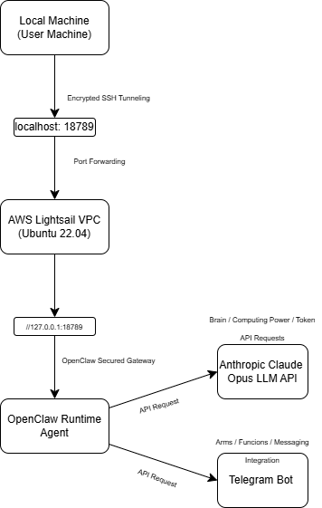

---

## Communication Process

### 1. Accessing the Dashboard

The user accesses the OpenClaw dashboard through a web browser using `http://localhost:18789`.

### 2. Establishing the Secure Tunnel

An SSH tunnel forwards the local port `18789` from the client machine to the AWS Lightsail instance, creating an encrypted communication channel.

### 3. Gateway Connection

The Lightsail server runs the OpenClaw Gateway, which listens locally on `127.0.0.1:18789`. The SSH tunnel allows the browser to securely communicate with this gateway without exposing it to the public internet.

### 4. Agent Runtime Execution

The OpenClaw runtime processes agent tasks, manages workflows, and coordinates communication between the gateway, configured tools, and external services.

### 5. AI Model Interaction

When AI processing is required, the OpenClaw gateway sends requests to the Anthropic Claude API to generate responses, perform reasoning tasks, or process instructions.

### 6. Messaging Integration (Telegram)

OpenClaw can also integrate with messaging platforms such as Telegram. Telegram bot integration is implemented in this lab as **the first example of many possible communication channels**, allowing users to send commands and receive responses from the agent through a messaging interface.

---

## 1. Infrastructure Setup

The first step of the deployment process is preparing the cloud infrastructure that will host the OpenClaw environment. In this lab, an AWS Lightsail virtual machine is created to run the OpenClaw gateway and agent runtime. Readers may also choose other cloud providers or virtual private server (VPS) platforms, although some providers may offer pre-installed environments at a higher cost.

A **general-purpose instance plan** is selected to provide sufficient compute resources for the OpenClaw runtime. The instance must have enough memory to execute the initial installation commands (such as the `curl` installation script), which many free-tier plans are unable to support. In this deployment, the author selected the most minimal plan that still provides adequate computing resources.

The Lightsail instance runs **Ubuntu Linux**, which serves as the host operating system for installing the OpenClaw CLI and its required dependencies.

This infrastructure layer forms the **cloud execution environment** of the overall architecture, where the OpenClaw gateway listens locally on port `127.0.0.1:18789` and processes requests forwarded through the SSH tunnel from the client machine.

**Figure 2.** AWS Lightsail Instance Configuration — [aws.amazon.com/lightsail](https://aws.amazon.com/lightsail/)

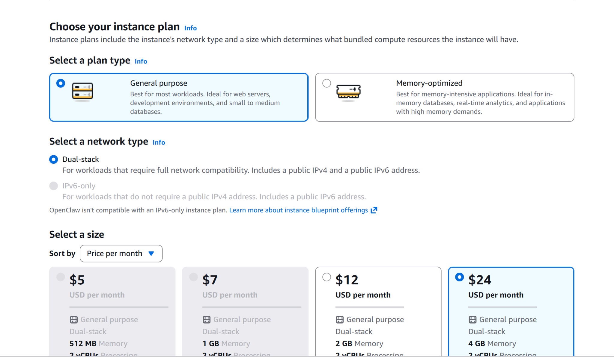

**Figure 3.** AWS Lightsail Instance Size Selection

The instance is deployed using the **Ubuntu 22.04 LTS operating system** platform. Ubuntu is selected because it provides similar compatibility for the required software while being more cost-effective than Windows-based instances.

Following the configuration shown in Figure 2, the instance size is set to **4 GB RAM, 2 vCPUs, and 80 GB SSD storage**. This configuration represents the minimum practical resources required to run the OpenClaw gateway and supporting services reliably. The author previously tested a **$12 instance plan**, which experienced memory pressure during installation and runtime.

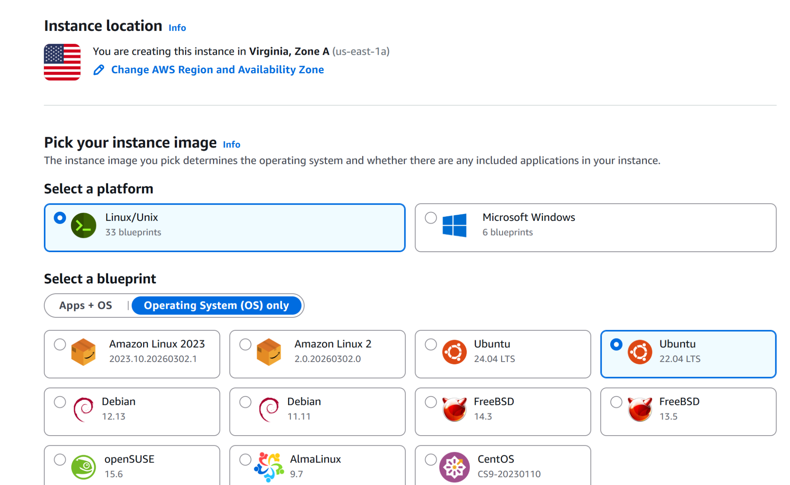

**Figure 4.** AWS Lightsail Instance Dashboard

From this interface, users can manage the instance lifecycle, including **starting, stopping, rebooting, and accessing the server through the browser-based SSH terminal**. The dashboard serves as the central control panel for interacting with the cloud environment that hosts the OpenClaw runtime.

AWS Lightsail currently provides a **3-month free tier for new users**, which is sufficient for testing and completing this deployment project without additional infrastructure cost. When the environment is not actively being used, stop the instance to avoid unnecessary resource usage and potential charges after the free-tier period expires.

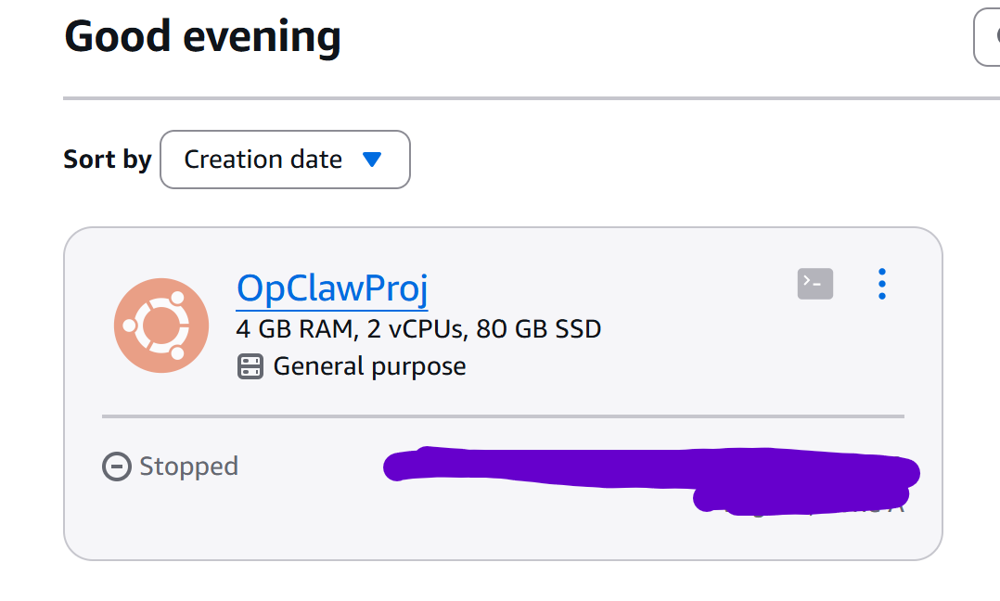

---

## 2. OpenClaw Installation

Install OpenClaw on the Lightsail server and verify that the CLI and gateway components are available.

**Figure 5.** OpenClaw Installation Command

To install OpenClaw in your VPC, navigate to the official OpenClaw website and locate the **Quick Start** section. This command retrieves the installation script from the OpenClaw repository and executes it through the shell, setting up the OpenClaw CLI and its dependencies on the server environment.

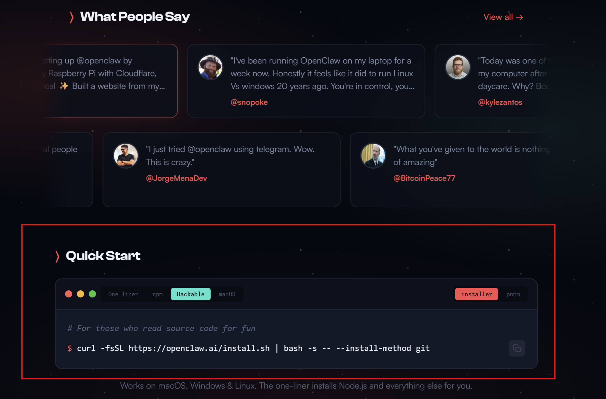

**Figure 6.** Creating an LLM API Key

While the OpenClaw installation process is running (which may take several minutes depending on the instance performance), prepare an API key for the language model service that will power the agent.

OpenClaw requires access to an external LLM in order to generate responses and perform reasoning tasks. Users may choose from several providers, including **OpenAI, Grok, Claude (Anthropic), or a locally deployed model such as Ollama**.

In this deployment, the author uses **Anthropic Claude** as the primary model provider. To create an API key, navigate to the Claude platform:

> <https://platform.claude.com/settings/keys>

From the **API Keys** section, create a new key and assign a descriptive name (for example `OpClawProj_Key`). This key will later be exported as an environment variable so that the OpenClaw gateway can authenticate and send requests to the Claude API.

> ⚠️ It is important to **keep the API key confidential**, as it grants the ability to consume model tokens and compute resources.

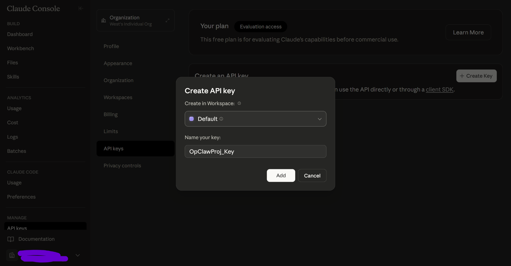

**Figure 7.** Recording and Securing the API Key

After the API key is generated, the platform will display it only once. Users should immediately **record and store the key in a secure location**, such as a password manager (for example Google Password Manager or another credential vault).

The API key functions as an **authentication credential** that allows OpenClaw to send requests to the LLM provider and consume model tokens. Because it grants access to computational resources and potentially billable API usage, the key **must never be shared publicly or committed to source code repositories**.

If the key is exposed, other users could utilize the API under the same account, resulting in **unauthorized usage or unexpected charges**. Therefore, the key should be treated similarly to a password or private SSH key.

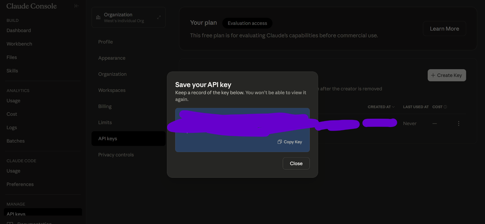

**Figure 8.** Configuring API Usage Limits

Although generating an API key is free, LLM token usage is not free. Each request sent to the model consumes tokens, which correspond to computational resources provided by the LLM service. As a result, users incur charges whenever the system processes prompts or generates responses.

To prevent unexpected costs, it is recommended to configure spending limits within the provider's dashboard. In the Claude platform, users can navigate to the Limits section to define a maximum monthly spending threshold.

Setting a spending limit ensures that API usage will automatically stop once the defined budget is reached, helping users maintain control over their operational expenses. Users should also practice efficient prompt usage, as unnecessarily long prompts or repeated requests can quickly increase token consumption.

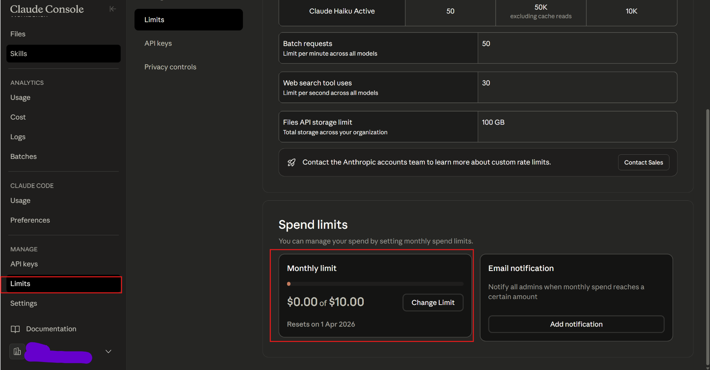

**Figure 9.** Connecting to the Lightsail Instance and Importing the API Key

After the API key has been created and securely stored, return to the AWS Lightsail dashboard and connect to the instance using the built-in **browser-based SSH terminal** or a local SSH client.

Once connected to the Ubuntu server, the API key must be exported as an environment variable so that OpenClaw can authenticate with the LLM provider. This allows the OpenClaw gateway to send requests to the selected language model service. Find the command in your preferred company's documentation page.

Example command:

```bash
export ANTHROPIC_API_KEY="your_api_key_here"
```

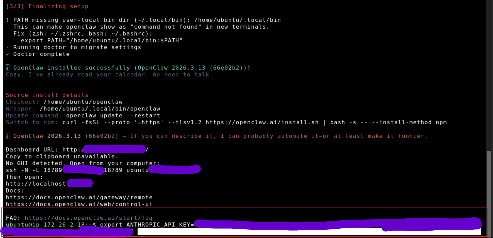

---

## 3. Secure Access via SSH Tunnel

Create an encrypted SSH tunnel from the local machine to the remote gateway so the dashboard can be accessed through `localhost`.

**Figure 10.** Verifying the OpenClaw Installation

After importing the API key into the environment, the next step is to verify that the OpenClaw CLI has been installed correctly on the Lightsail instance.

Running the `openclaw` command confirms that the installation completed successfully and that the CLI is accessible from the current shell environment. If the command is not found initially, it may be necessary to reference the full installation path depending on the current PATH configuration (for example `/home/ubuntu/.local/bin/openclaw`).

The output shown in Figure 10 demonstrates a successful installation where the OpenClaw CLI displays its available command modules, including agent management, gateway control, configuration tools, and messaging integrations.

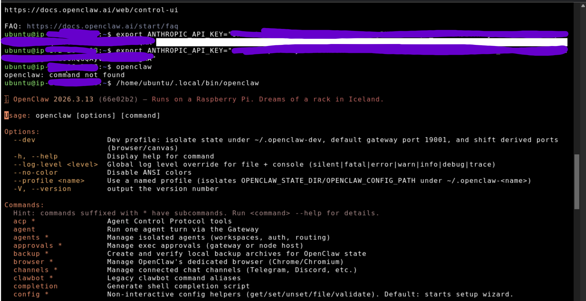

**Figure 11.** Retrieving the OpenClaw Gateway Token

After confirming that OpenClaw has been installed successfully, return to the AWS Lightsail dashboard and open a **new SSH terminal window** by clicking **"Connect using SSH."**

A second terminal session is required because the first command window is typically used for a persistent SSH connection or for running long-lived processes (such as the SSH tunnel). Keeping a separate terminal allows users to execute additional commands without interrupting the existing session.

In the new SSH session, run the following command to retrieve the **OpenClaw dashboard token**:

```bash
/home/ubuntu/.local/bin/openclaw dashboard --no-open
```

This command generates a **tokenized dashboard URL**, which includes the authentication token required to access the OpenClaw control interface. Since the server does not have a graphical browser, the `--no-open` flag prevents the system from attempting to launch a browser on the server.

Copy the generated **Dashboard URL** (which contains the gateway token) and open it from the **local machine's browser** through the SSH tunnel established earlier.

> 💡 Store the token in a password manager (just like your API Key) for later use.

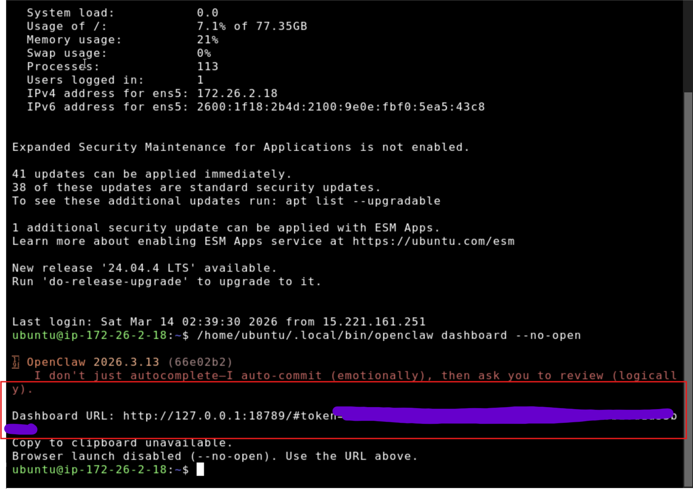

**Figure 12.** Establishing an SSH Tunnel — Option 1

To securely access the OpenClaw gateway running on the Lightsail instance, a local SSH tunnel is created from the client machine. This tunnel forwards a local port on the user's computer to the remote OpenClaw service running on the server. Run this command in your local machine PowerShell.

General command structure:

```bash
ssh -N -L <LOCAL_PORT>:<REMOTE_HOST>:<REMOTE_PORT> <USER>@<SERVER_IP>
```

Command options:

- `-N` — Indicates that no remote command will be executed. The SSH session is used only for port forwarding.
- `-L` — Specifies local port forwarding, allowing traffic sent to the local port to be forwarded securely to the remote host and port through the SSH connection.
- `18789` — Port number for OpenClaw.

Example used in this deployment:

```bash
ssh -N -L 18789:127.0.0.1:18789 ubuntu@<SERVER_IP>
```

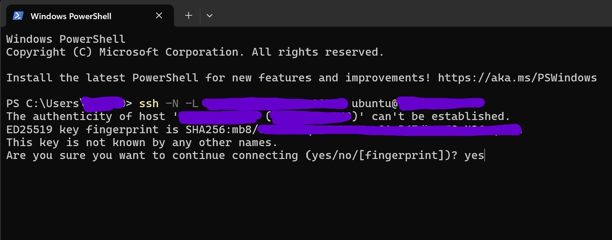

**Figure 13.** Establishing an SSH Tunnel — Option 2 (Using .pem Key)

For AWS Lightsail instances, SSH access may need to be performed using the downloaded **private key (.pem)** instead of the browser-based terminal. This method is useful when creating a persistent SSH tunnel from the local machine.

From the Lightsail instance page, navigate to the **Connect** tab and download the default SSH key provided by AWS. The key is associated with the region where the instance was created and is required for authentication when connecting through an external SSH client.

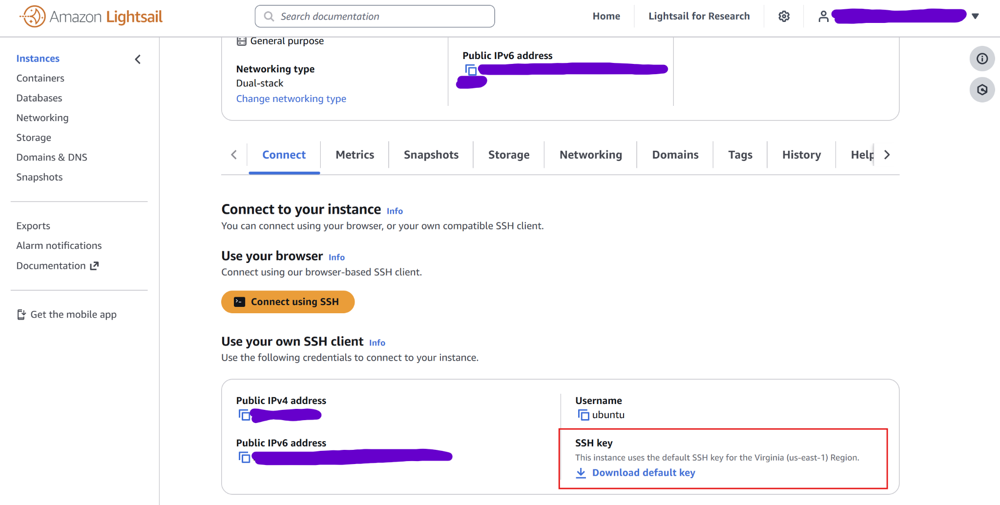

---

## 4. Gateway Authentication

Retrieve and apply the gateway token required for the OpenClaw web interface to connect securely.

**Figure 14.** Establishing an SSH Tunnel — Option 2 (Continued)

Run this connection in your local machine PowerShell.

General command structure:

```bash
ssh -i <PRIVATE_KEY_PATH> -N -L <LOCAL_PORT>:<REMOTE_HOST>:<REMOTE_PORT> <USERNAME>@<SERVER_IP>
```

Command parameters:

- `-i <PRIVATE_KEY_PATH>` — Specifies the path to the Lightsail private key (`.pem`) used for authentication.
- `-N` — Indicates that no remote command will be executed and the connection is used only for port forwarding.
- `-L` — Enables local port forwarding, allowing traffic from a local port to securely reach the remote service.

Example used in this deployment:

```bash
ssh -i LightsailDefaultKey.pem -N -L 18789:127.0.0.1:18789 ubuntu@<SERVER_IP>
```

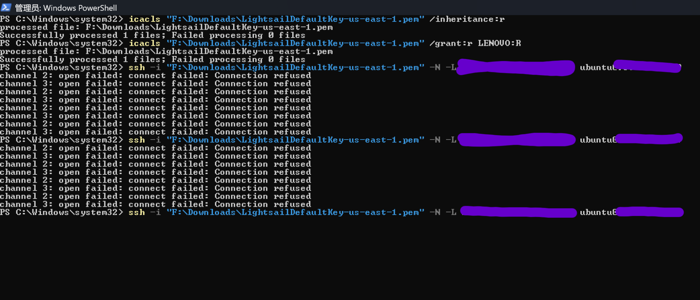

---

## 5. Model Integration

Configure Anthropic Claude API access so OpenClaw can use the selected language model.

**Figure 15.** Accessing the OpenClaw Gateway Dashboard

After the SSH tunnel has been successfully established, the PowerShell terminal will remain active without displaying additional output. This indicates that the SSH connection is running and forwarding traffic from the local machine to the remote Lightsail server.

At this point, open a web browser on the **local machine** and navigate to the following address:

```
http://localhost:18789
```

Because the SSH tunnel forwards the local port `18789` to the OpenClaw gateway running on the Lightsail instance, the dashboard interface will load in the browser even though the service is actually running on the remote server.

The OpenClaw Gateway dashboard will appear as shown in Figure 15. From this interface, users can connect to the gateway by providing the previously generated **gateway authentication token**, which allows the browser client to communicate securely with the OpenClaw runtime.

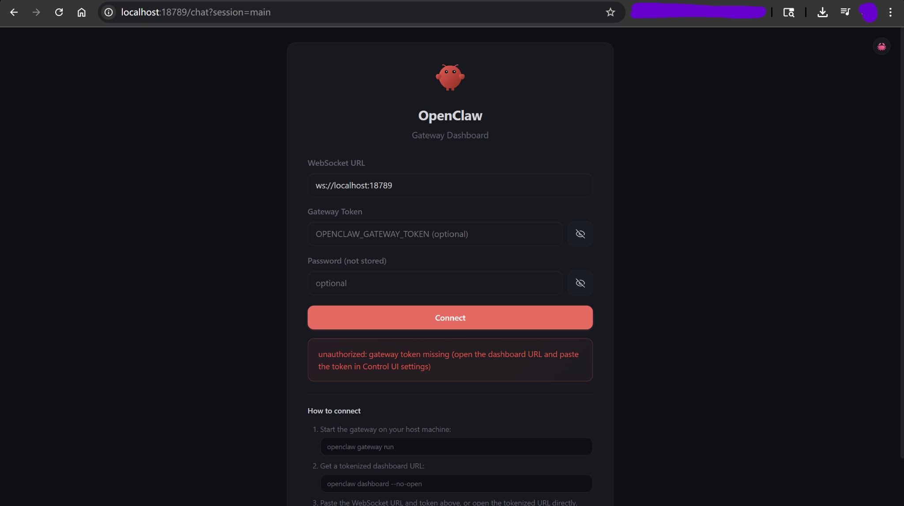

**Figure 16.** Entering the Gateway Authentication Token

Once the OpenClaw Gateway dashboard loads in the browser (`http://localhost:18789`), the interface will prompt for a **Gateway Token** before allowing access to the control panel.

Copy the **gateway token** that was generated earlier from the Lightsail terminal (shown in Figure 11) and paste it into the **Gateway Token** field on the dashboard. After inserting the token, click **Connect** to authenticate the browser session with the OpenClaw gateway.

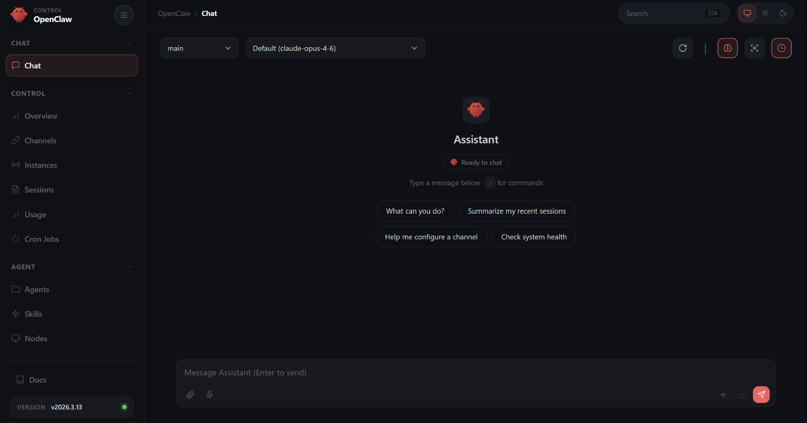

---

## 6. Security Hardening

Apply security controls such as restricted SSH key permissions, gateway authentication protection, least-privilege operational rules, and task runtime limits.

**Figure 17.** Applying OpenClaw Gateway Security Hardening

After successfully accessing the OpenClaw dashboard, the next step is to harden the security configuration of the gateway. The official OpenClaw security guidelines can be found at:

> <https://docs.openclaw.ai/gateway/security>

The settings listed on this page should be implemented and verified to ensure the gateway is properly secured. These configurations typically include verifying file permissions, restricting gateway binding behavior, and confirming that authentication mechanisms are functioning correctly.

During this step, the OpenClaw agent can be used to run a security audit that checks the current system state and identifies any configuration issues. The agent will review items such as configuration file permissions and directory access levels before applying recommended hardening settings.

> ⚠️ For this lab environment, the configuration parameter `allowinsecureauth` is intentionally left set to `true` so that local testing through the SSH tunnel can proceed without additional authentication barriers.

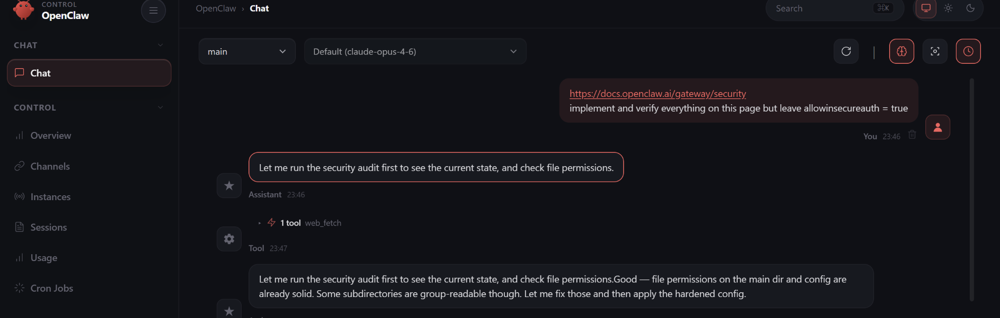

**Figure 18.** Security Hardening Verification Results

After the security audit and configuration adjustments are completed, OpenClaw displays a summary of the applied security settings.

This verification step ensures that the OpenClaw environment is operating under a hardened configuration while still allowing the necessary access for development and testing purposes. Proper security validation helps prevent unauthorized access, misconfigured permissions, and unintended exposure of the gateway service.

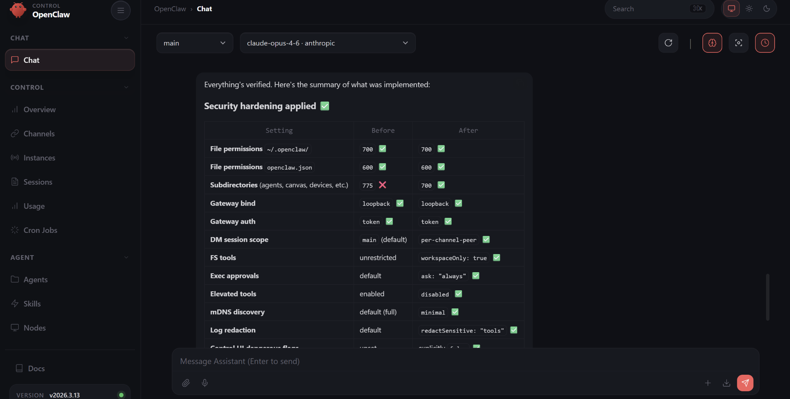

**Figure 19.** Implementing the Principle of Least Privilege

After completing gateway security hardening, operational safeguards should be added to control how the OpenClaw agent performs actions. One important security concept implemented in this setup is the **principle of least privilege**, which ensures that the agent only performs actions that are explicitly approved by the user.

Operational rules are added to the agent configuration to restrict sensitive actions. The following policies are enforced:

- When sending files on behalf of the user, the agent must **draft the file first and request approval** before transmitting it.
- The agent must **always ask for confirmation before deleting any files**.
- The agent must **ask for permission before making outbound network requests**, such as web fetch operations or API calls.

To configure these rules, type the following instruction into the **OpenClaw chat interface**:

```
Implement principle of least privilege:
When sending files on my behalf, always draft the file first and get my approval.
Always ask before deleting files.
Always ask before making network requests.
```

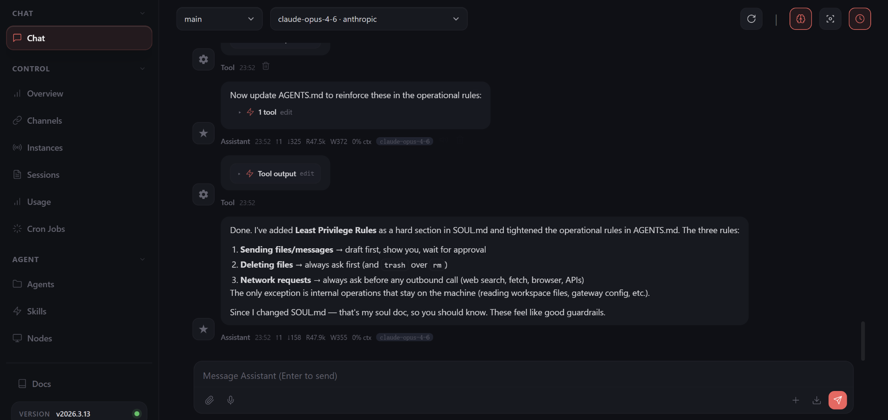

**Figure 20.** Runtime Safety Controls for Agent Tasks

Additional runtime safety controls should also be implemented to prevent uncontrolled or infinite task execution.

To configure these limits, type the following instruction in the OpenClaw chat:

```
If a task fails 3 times, stop.
Do not let any task run indefinitely.
Limit task runtime to 10 minutes unless I explicitly say otherwise.
```

These safeguards ensure that automated processes remain controlled, prevent runaway executions, and help reduce unnecessary consumption of system resources or API tokens.

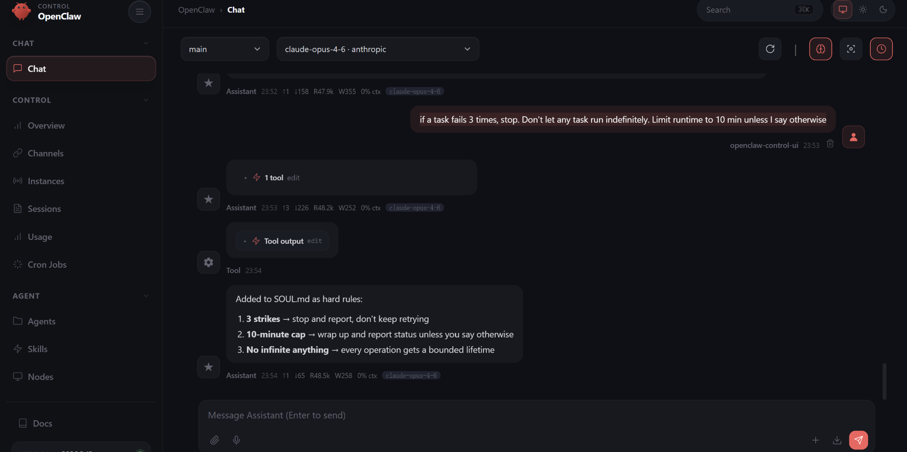

---

## 7. Telegram Bot Integration

Connect Telegram to OpenClaw so the agent can receive and respond to messages through the bot.

**Figure 21.** Creating a Telegram Bot Using BotFather

To integrate OpenClaw with Telegram, a Telegram bot must first be created. Telegram provides an official management bot called **BotFather**, which is used to create and manage all Telegram bots.

Open the Telegram application and search for **BotFather** (the verified account). Start a conversation and type:

```
/start
```

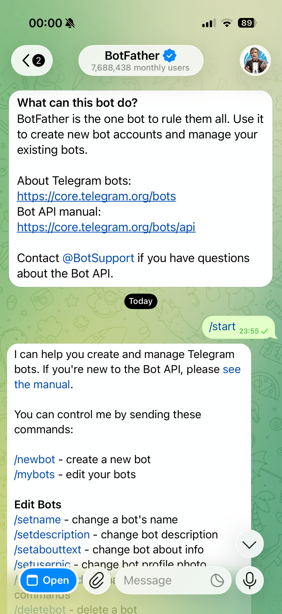

**Figure 22.** Creating a New Telegram Bot

After starting a conversation with **BotFather**, create a new bot by typing the following command:

```
/newbot
```

BotFather will guide you through two steps:

1. **Bot Name** — the display name users will see.
2. **Bot Username** — must end with `bot` (for example: `openclaw_agent_bot`).

After completing these steps, BotFather will generate a **Telegram Bot Token**. This token acts as the authentication credential that allows OpenClaw to communicate with Telegram through the Bot API.

> ⚠️ **Important:** Keep the bot token private. Anyone with access to the token can control the bot and send messages through it.

The generated token will later be used when configuring the Telegram channel inside OpenClaw.

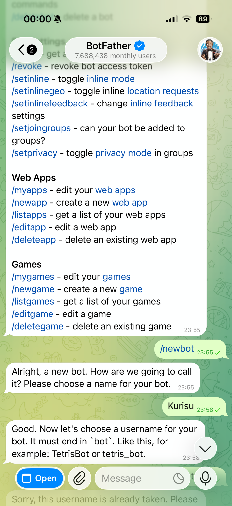

**Figure 23.** Telegram Bot Successfully Created

After choosing an available username, BotFather will confirm that the new Telegram bot has been created successfully. If a username is already taken, BotFather will prompt you to try another one until a unique username is accepted.

Once the bot is created, BotFather will display several important pieces of information:

1. A **direct link to the bot** (for example `t.me/<YourBotName>`), which allows users to open the bot in Telegram.
2. The **Telegram Bot API token**, which is required for external applications such as OpenClaw to communicate with the bot.
3. A reminder to **keep the token secure**, since anyone with access to the token can control the bot.

> ⚠️ **Important:** The API token shown in the message must be stored securely. It will be used later when configuring the **Telegram channel integration inside OpenClaw**.

At this stage, the Telegram bot is fully created and ready to be connected to the OpenClaw agent.

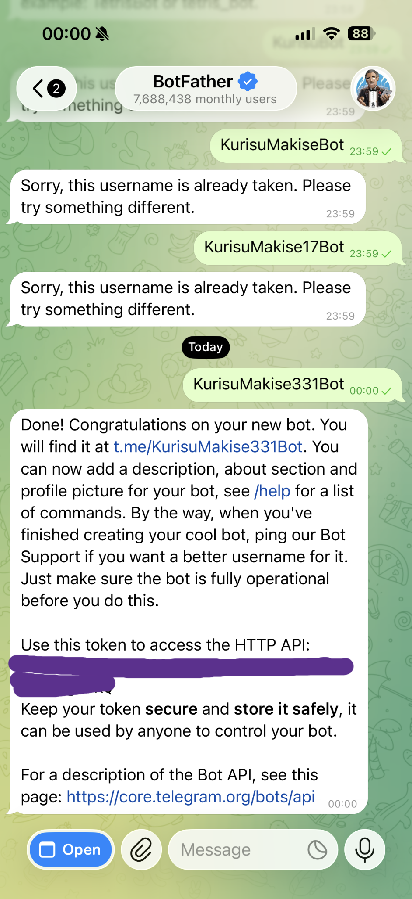

**Figure 24.** Connecting the Telegram Bot to OpenClaw

After obtaining the Telegram bot token from BotFather, return to the OpenClaw dashboard and configure the Telegram integration through the chat interface.

In the OpenClaw chat box, enter the following instruction and paste the token you received from BotFather:

```
connect to telegram token <TELEGRAM_BOT_TOKEN>
```

The OpenClaw agent will automatically update the gateway configuration and initialize the Telegram channel. During this process, the system may restart the gateway configuration and display a **pairing code** in the logs. This code is used to confirm that the Telegram account communicating with the bot is authorized to interact with the OpenClaw agent.

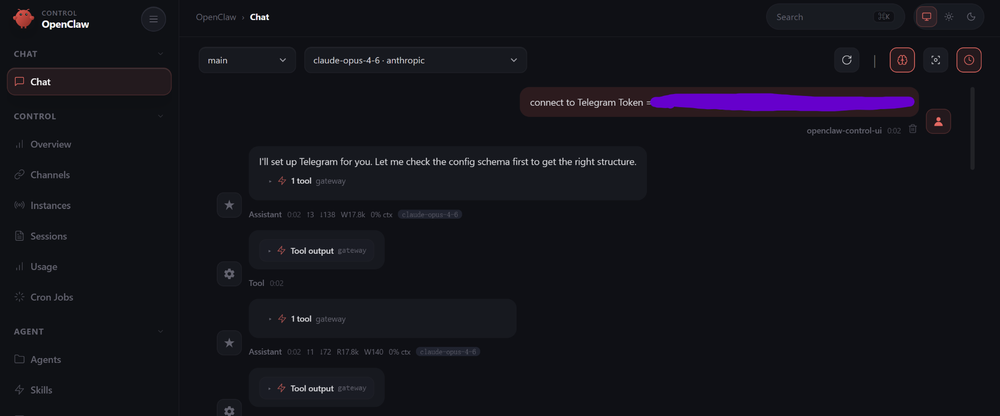

**Figure 25.** Telegram Pairing and Authorization

After the Telegram bot connection is established, OpenClaw will generate a **pairing code**. To complete the setup:

1. Open Telegram.
2. Search for the newly created bot.
3. Send a message (for example `/start`) to the bot.
4. Approve the pairing request using the code displayed in the OpenClaw logs.

Once the pairing process is completed, OpenClaw will confirm that the Telegram account has been successfully approved. From this point onward, users can send messages to the Telegram bot, and the OpenClaw agent will process and respond to those messages.

This allows the OpenClaw agent to operate remotely through Telegram as one of its communication interfaces.

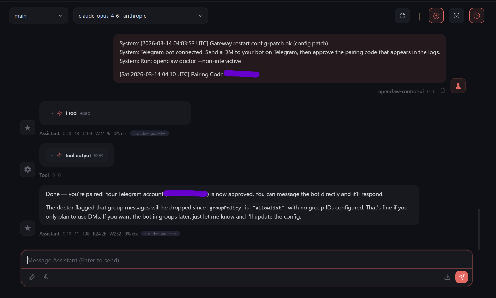

**Figure 26.** Telegram Bot Pairing Request

After sending `/start` to the newly created Telegram bot, the bot will respond with a **pairing request message**. This message contains the **Telegram user ID** and a **pairing code** that must be approved from the OpenClaw control interface.

To approve the connection, return to the **OpenClaw dashboard chat interface** and enter the command provided in the message:

```bash
openclaw pairing approve telegram <PAIRING_CODE>
```

Replace `<PAIRING_CODE>` with the pairing code shown in the Telegram message. Once the command is executed successfully, the Telegram account will be authorized to communicate with the OpenClaw agent. After approval, messages sent to the Telegram bot will be processed by OpenClaw and responses will be returned through Telegram.

This completes the Telegram integration, allowing the OpenClaw agent to operate remotely through the messaging platform.

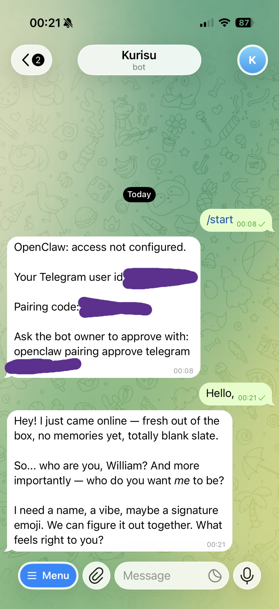

**Figure 27.** Telegram Channel Successfully Connected to OpenClaw

After approving the pairing request, the Telegram account becomes authorized to interact with the OpenClaw agent. At this point, messages sent from Telegram will appear inside the **OpenClaw dashboard chat interface**, confirming that the integration is functioning correctly.

In the dashboard, the conversation source will be labeled with the **Telegram channel identifier**, indicating that the message originated from Telegram rather than the local web interface. The OpenClaw agent processes the incoming message using the configured language model and returns the response through the same communication channel.

This confirms that the Telegram bot is fully integrated with OpenClaw and can now be used as a remote interface for interacting with the agent. Users may send prompts directly through Telegram, and the responses will be synchronized with the OpenClaw control panel.

At this stage, the OpenClaw deployment is operational with the following components working together:

- AWS Lightsail cloud infrastructure hosting the OpenClaw gateway
- Secure SSH tunneling between the local client and the remote server
- Anthropic Claude API integration for AI processing
- Telegram bot integration for remote messaging and agent interaction

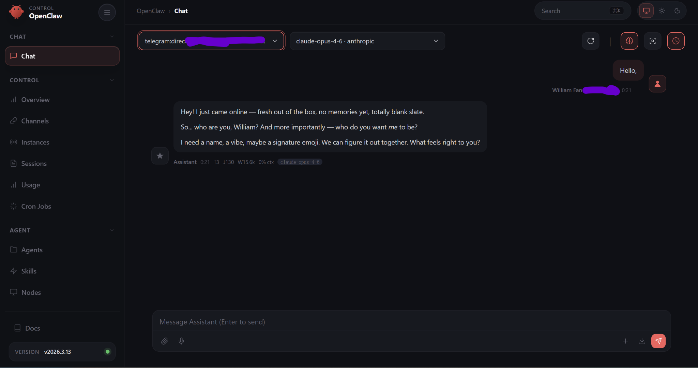

---

## 8. Troubleshooting

Resolve common setup issues such as SSH permission errors, missing gateway tokens, PATH problems, and connection failures.

| Issue | Solution |
|-------|---------|
| `openclaw` command not found | Use the full path: `/home/ubuntu/.local/bin/openclaw`, or add it to your `PATH`. |
| SSH tunnel connection refused | Ensure the OpenClaw gateway is running on the server and listening on port `18789`. |
| SSH key permission error | Run `chmod 400 LightsailDefaultKey.pem` to restrict the key file permissions. |
| Gateway token not accepted | Regenerate the token using `openclaw dashboard --no-open` and try again. |
| Telegram bot not responding | Verify the bot token is correct and that the pairing has been approved in OpenClaw. |
| API key not working | Confirm the environment variable is exported: `echo $ANTHROPIC_API_KEY`. |
=======
# openclaw-guide
A comprehensive guide to deploying, configuring, and extending OpenClaw
>>>>>>> 0e10df8782a6e8910f8580dcda3675b76491f17f
